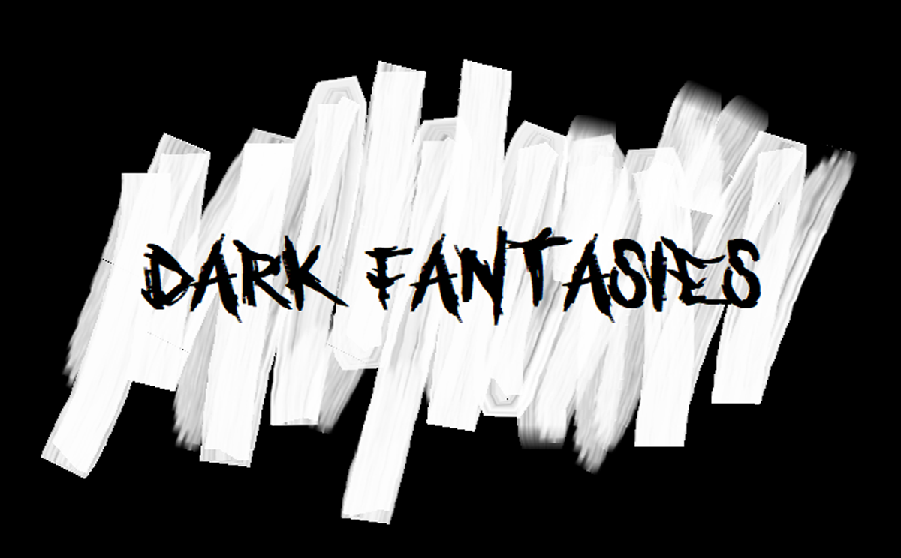

<br />
<p align="center">
    

  <h3 align="center">Project DF</h3>

  <p align="center">
    ·
    <a href="https://github.com/RyuTribal/DarkFantasies/issues">Report Bug</a>
    ·
    <a href="https://github.com/RyuTribal/DarkFantasies/issues">Request Feature</a>
    ·
    <a href="https://github.com/RyuTribal/DarkFantasies/projects/1">Check what issues are avaliable</a>
  </p>
</p>

<!-- TABLE OF CONTENTS -->
<details open="open">
  <summary>Table of Contents</summary>
  <ol>
    <li>
      <a href="#about-the-project">About The Project</a>
      <ul>
        <li><a href="#built-with">Built With</a></li>
      </ul>
    </li>
    <li>
      <a href="#getting-started">Getting Started</a>
    </li>
    <li><a href="#git-commands">Git Commands</a></li>
    <li><a href="#unreal-issues">Common Issues with Unreal</a></li>
    <li><a href="#contact">Contact</a></li>
  </ol>
</details>

<!-- ABOUT THE PROJECT -->

## About The Project

Project-DF originally started as a piece of software to practice our C++ skills on. After finishing what we set out to do, we decided to continue
with this project. 

Project DF or simply Dark Fantasies follows a young high schooler with a typical issue with bullying. He overcomes his fears and bullies by defeating them in his
day dreams. But this can have dark consequences depending on what the player chooses to do with them.

This game is a 3rd-person action rpg in a dark fantasy setting. The combat system is sword based with a soulslike feel to it.
Insperations are mostly drawn from Nioh, Sekiro and Dark souls. The bosses are the main focus of this game which is why it's important to make 
them feel as epic as possible.

Currently we are working towards a BETA-version that can be then released for play testing.

### Built With

This section lists all the recommended software to use
    
**Crucial!** You have to use these:

- [Unreal Engine 4 (version 4.25)](https://www.unrealengine.com)
- [Git](https://git-scm.com/)
- [Git LFS](https://git-lfs.github.com/): Follow the first step below the download link
- [Visual Studio Community](https://visualstudio.microsoft.com/vs/community/): Coding Enviroment
  - .NET desktop development
  - Desktop development with C++
  - Universal Windows Platform development
  - Game development with C++

    
**Optional!** Recommended software:

- [ZBrush](https://pixologic.com/): 3D Modelling tool
- [Maya](https://www.autodesk.se/products/maya/overview): All around 3D tool
- [Photoshop](https://www.adobe.com/se/products/photoshop.html?sdid=8JD95K3M&mv=search&ef_id=CjwKCAiAgJWABhArEiwAmNVTBwmDVLjrOBZXFJEbfUsJoDKiGo-fHnp_AsrNC0eCDJZxULmcnjDPXhoCWOcQAvD_BwE:G:s&s_kwcid=AL!3085!3!340816129392!e!!g!!photoshop!1469952956!58520335113&gclid=CjwKCAiAgJWABhArEiwAmNVTBwmDVLjrOBZXFJEbfUsJoDKiGo-fHnp_AsrNC0eCDJZxULmcnjDPXhoCWOcQAvD_BwE): 2d asset creation
- [3DS MAX](https://www.autodesk.se/products/3ds-max/overview?mktvar002=afc_se_buyonline&AID=11043108&PID=8227014&SID=jkp_CjwKCAiAgJWABhArEiwAmNVTB_zMIWvjptZ8aXoGQBjbBGIix4NjtLjQbJWpetNCmmQGl2WhBDv9WxoCn08QAvD_BwE&cjevent=cd41e57559e311eb838b01a20a18050d&affname=8227014_11043108): Animation Software

## Getting Started

To get this project up and running locally you first need to download Unreal Engine 4 (version 4.25) (You will need to create an account) and download git, with git LFS.
After all this is done create a local account with git in your console commands like so:

```
git config --global user.name "John Doe"
git config --global user.email johndoe@example.com

```

After this make sure you are standing inside a folder (in the console) where you would like the project to exist. 
After you can run the command: 

```
git clone https://github.com/RyuTribal/DarkFantasies.git

```
Lastly navigate to the projects folder and press the "Project_DF.uproject" file and let it generate new engine files. After it will open it automatically

## Git Commands

To create a branch:
```
git branch your-branch-name
```
To switch branches:
```
git checkout your-branch-name
```
To save changes made to a file:
```
git add .
```

To finalize your changes (no going back):
```
git commit -m "A useful message for the other developers about what changes you made"
``` 

To push code to a branch:
```
git push origin your-branch-name
```

To pull new changes from a branch:
```
git pull origin your-branch-name
```

## Common Issues with Unreal

Sometimes Unreal Engine might crash, if that happens just restart it. If it keeps on crashing, it might be that some code you are running might crash, so if you've
made any changes recently to the code that could break something, review it.

<!-- CONTACT -->

## Contact

Ivan Sedelkin - ivan.sedelkin9@gmail.com - 0701628959

Mohammed Shakir - mohammedshakir010528@gmail.com